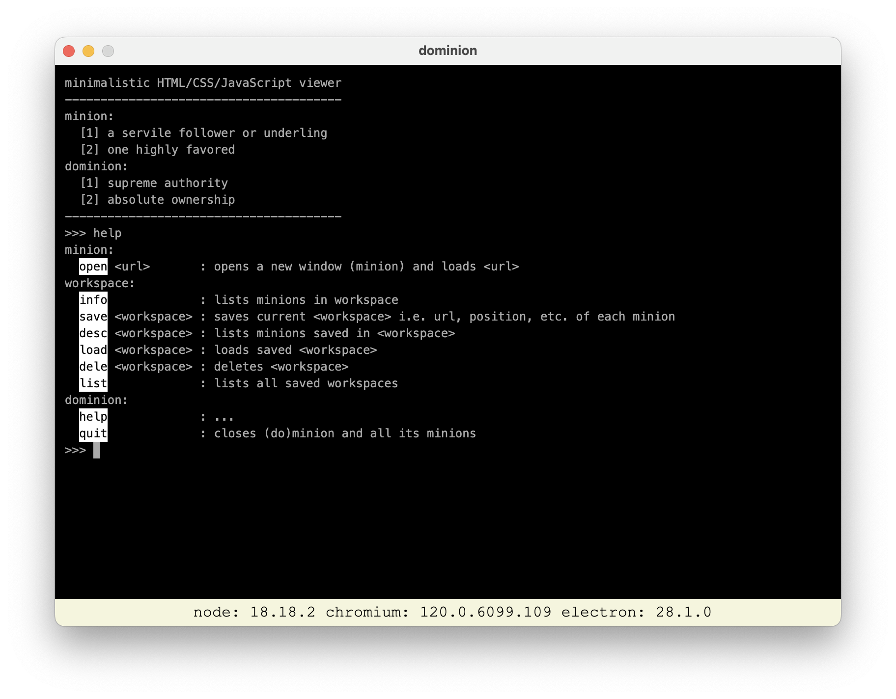

# minimalistic HTML/CSS/JavaScript viewer

## why?

In some industries browsers + tabs are not the most suitable paradigm.

Collections of windows displaying relevant information one can interact with is the go.

`minion` does just that (and almost nothing else).

## how?

Just enough HTML, CSS and JavaScript wrapped in an [electron](https://www.electronjs.org) layer, exposing a console like interface built using [jQuery.terminal](https://terminal.jcubic.pl), implementing just enough commands to get the job done.

## installation

MacOS only at this stage, but since `minion` is built using [electron](https://www.electronjs.org) should be relatively straightforward cut releases for Windows and Linux - PR welcome!

### [brew](https://brew.sh) [tap](https://github.com/3kwa/homebrew-minion)

Since `v1.0.5`, first (and only once):

    brew tap 3kwa/minion

Then:

    brew install minion --no-quarantine

The `--no-quarantine` is necessary _for now_.

### [Releases](https://github.com/3kwa/minion/releases)

#### DMG

Since `v1.0.5` releases include a DMG file. Download, open, drag and your are done.

#### ZIP

The old school way, since `v1.0.0`, releases include a ZIP file. Download, unzip and mess around.

    rm -rf /Applications/minion.app && mv <unzipped>/minion.app /Applications/minion.app
