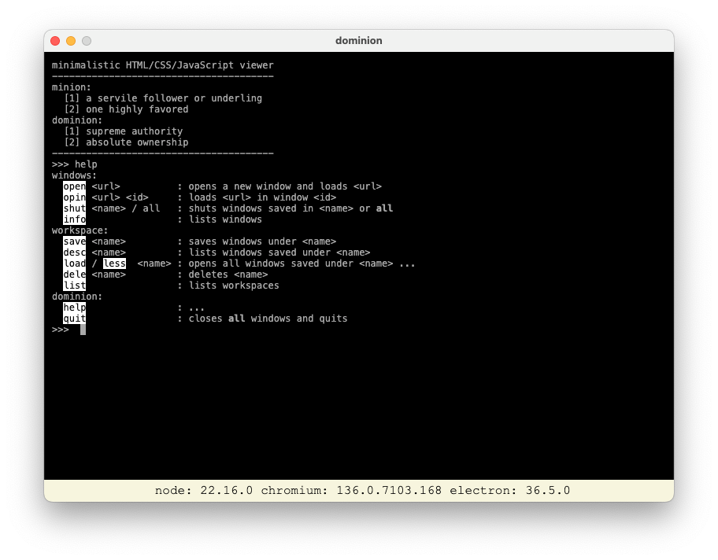

# minimalistic HTML/CSS/JavaScript viewer

## why?

In some industries browsers + tabs are not the most suitable paradigm.

Collections of windows displaying relevant information one can interact with is the go.

`minion` does just that (and almost nothing else).

## how?

Just enough HTML, CSS and JavaScript wrapped in an [electron](https://www.electronjs.org) layer, exposing a console like interface built using [jQuery.terminal](https://terminal.jcubic.pl), implementing just enough commands to get the job done.

## installation

The old school way for now, visit [releases](https://github.com/3kwa/minion/releases), download and mess around.
